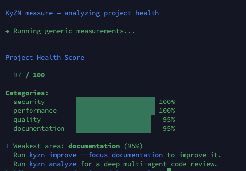
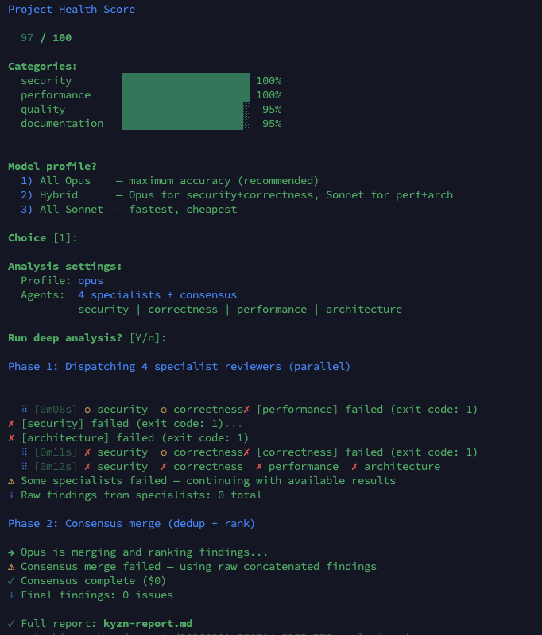
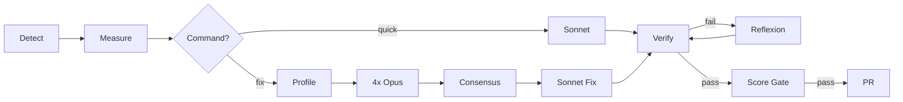

<p align="center">
  
</p>

<p align="center">
  <a href="https://github.com/bokiko/KyZN"></a>
  <a href="https://x.com/bokiko"></a>
</p>

<p align="center">
  
  
  
  
  
  
</p>

<p align="center">
  <a href="https://git.io/typing-svg"></a>
</p>

## Contents

- [Quick Demo](#quick-demo)
- [Quick Start](#quick-start)
- [Configuration](#configuration)
- [Features](#features)
- [Usage](#usage)
- [How It Works](#how-it-works)
- [Safety](#safety)
- [Security](#security)
- [Project Structure](#project-structure)
- [License](#license)

---

## Overview

**KyZN** (from _kaizen_ — continuous improvement) measures your project's health with real tools, sends the results to Claude Code with strict safety constraints, verifies the changes, and opens a PR — all autonomously. Supports Node.js, Python, Rust, and Go out of the box.

<div align="center">
  
</div>

---

## Quick Demo

```bash
$ cd your-project
$ kyzn measure

  Project Health Score

  68 / 100

  Categories:
  security        ████████████████░░░░  80%
  testing         ██████████░░░░░░░░░░  50%
  quality         ██████████████░░░░░░  72%
  performance     ████████████████████ 100%
  documentation   ████████████░░░░░░░░  60%

  ℹ Weakest area: testing (50%)
    Run kyzn fix for deep analysis + auto-fix.
```

That's it — one command, zero config. KyZN runs your project's real tools (eslint, ruff, clippy, go vet) and produces a health score. Then `kyzn fix` runs 4 Opus specialists in parallel, deduplicates findings, and Sonnet fixes them in severity batches — all verified and shipped as a PR.

See [`docs/examples/sample-report.md`](docs/examples/sample-report.md) for what a full analysis report looks like.

---

## Quick Start

### Prerequisites

| Tool | Required | Purpose |
|------|----------|---------|
| `git` | Yes | Branch management |
| `gh` | Yes | PR creation |
| `claude` | Yes | [Claude Code CLI](https://docs.anthropic.com/en/docs/claude-code) |
| `jq` | Yes | JSON processing |
| `yq` | Yes | YAML config |

> **macOS:** Requires Bash 4.3+ (`brew install bash`). The system `/bin/bash` is v3.2 and will not work.

### Installation

```bash
# One-liner (recommended)
curl -fsSL https://raw.githubusercontent.com/bokiko/KyZN/main/install.sh | bash

# Or clone manually
git clone https://github.com/bokiko/KyZN.git ~/.kyzn-cli
ln -sf ~/.kyzn-cli/kyzn ~/.local/bin/kyzn

# Verify
kyzn doctor
```

### Authentication

KyZN needs Claude Code authenticated. Pick **one** method:

**Option A — OAuth login (recommended)**
```bash
claude    # Opens browser, log in once, done
```

**Option B — API key**
```bash
export ANTHROPIC_API_KEY="sk-ant-..."
```

> **Heads up:** If `ANTHROPIC_API_KEY` is set in your shell, Claude will use it instead of OAuth — even if the key is expired. If `kyzn doctor` shows "Claude auth: API key" but things fail, run `unset ANTHROPIC_API_KEY` to fall back to OAuth.

To switch between methods:
- **Use OAuth:** `unset ANTHROPIC_API_KEY` (and remove any export from `~/.bashrc`)
- **Use API key:** `export ANTHROPIC_API_KEY="sk-ant-..."`

`kyzn doctor` shows which method is active.

### First Run

```bash
cd your-project
kyzn doctor     # Verify prerequisites
kyzn init       # One-time setup
kyzn measure    # See your health score
kyzn fix        # Deep analysis + auto-fix → PR
```

---

## Configuration

Run `kyzn init` to create `.kyzn/config.yaml` interactively. Three improvement modes: **deep** (real bugs only), **clean** (dead code + naming), **full** (everything). See [`.kyzn.example.yaml`](.kyzn.example.yaml) for all options or [`docs/how-it-works.md`](docs/how-it-works.md) for full reference.

---

## Features

<table>
<tr>
<td width="50%">

### Fix
- **Full pipeline**: analyze → fix → verify → PR in one command
- Profiler scans repo conventions before analysis
- Severity-batched: CRITICAL → HIGH → MEDIUM → LOW
- Reflexion retry on build failure

</td>
<td width="50%">

### Analyze
- **4 Opus specialists in parallel** — security, correctness, performance, architecture
- Consensus engine deduplicates and ranks findings
- Compact one-liner terminal output + detailed `kyzn-report.md`
- `--fix` mode: full report context passed to Sonnet for accurate fixes

</td>
</tr>
<tr>
<td width="50%">

### Measure
- Runs real tools (eslint, ruff, clippy, go vet)
- Health score out of 100 across 5 categories
- Weighted scoring with custom priorities
- Per-language measurers for Node, Python, Rust, Go

</td>
<td width="50%">

### Doctor
- Checks all prerequisites (git, gh, claude, jq, yq)
- Reports missing optional tools per language
- Shows Claude authentication method
- Verifies Bash version compatibility

</td>
</tr>
<tr>
<td width="50%">

### Verify
- Runs build + tests after every change
- Pre-existing failure detection
- Score regression gate — aborts if score drops
- Per-category floor — aborts if any area drops > 5pts

</td>
<td width="50%">

### Ship
- Auto-creates PR with before/after comparison
- Branch isolation — never touches main
- Approve/reject workflow with feedback
- Schedule daily or weekly via cron

</td>
</tr>
</table>

---

## Usage

### Fix (recommended — deep analysis + auto-fix)

```bash
kyzn fix                           # Full pipeline: analyze → fix → verify → PR
kyzn fix --auto                    # Non-interactive (cron-safe)
kyzn fix --profile hybrid          # Cheaper analysis model mix
kyzn fix --min-severity HIGH       # Only fix HIGH+ severity findings
kyzn fix --fix-budget 10.00        # Budget for fix phase
```

One command does everything: profiler scans your repo's conventions, 4 Opus specialists find issues in parallel, consensus deduplicates, Sonnet fixes in severity batches with build/test verification, and opens a PR. If a fix breaks the build, reflexion retry gives Sonnet a second chance.

### Analyze (multi-agent Opus deep analysis)

```bash
kyzn analyze                        # 4 Opus specialists + consensus (~$20)
kyzn analyze --fix                  # Analyze then Sonnet fixes top issues
kyzn analyze --focus security       # Single specialist (security only)
kyzn analyze --single               # Single general reviewer (cheaper)
kyzn analyze --budget 30.00         # Higher budget for large codebases
kyzn analyze --min-severity HIGH    # Only fix HIGH+ severity in --fix mode
kyzn analyze --export report.md     # Export report to custom path
```

Terminal output is compact (one line per finding). Full details are saved to `kyzn-report.md` in the project root and archived in `.kyzn/reports/`. When `--fix` runs, the full report is passed to Sonnet so it has complete context for each fix.

> **Tip:** `kyzn analyze --fix` is equivalent to `kyzn fix`.

<div align="center">
  
</div>

### Quick (lightweight single-pass)

```bash
kyzn quick                          # Interactive — choose model & budget
kyzn quick --auto                   # Non-interactive (for cron)
kyzn quick --mode deep              # Real improvements only
kyzn quick --mode clean             # Cleanup only (dead code, naming)
kyzn quick --mode full              # Everything
kyzn quick --focus security         # Target a specific area
kyzn quick --model opus             # Use a specific model
kyzn quick --budget 5.00            # Override budget cap
kyzn quick -v                       # Show live progress
```

### Review

```bash
kyzn history                        # Show all runs with scores
kyzn diff <run-id>                  # Show what changed
kyzn approve <run-id>               # Sign off on improvements
kyzn reject <run-id> -r "reason"    # Reject with feedback
```

### Automate

```bash
kyzn schedule daily                 # Run at 3am daily via cron
kyzn schedule weekly                # Run weekly (Sundays)
kyzn schedule off                   # Remove schedule
```

---

## How It Works



> [!TIP]
> See [`docs/how-it-works.md`](docs/how-it-works.md) for detailed architecture, health score weights, modes, and supported languages.

---

## Safety

KyZN runs AI with real tool access on your code. Every layer of the pipeline has safety constraints to prevent damage, overspending, and data leaks.

| Layer | Protection |
|-------|-----------|
| **Untrusted repos** | Do not run KyZN on repositories you don't trust — build/test commands are executed |
| **Branch isolation** | All changes on `kyzn/` branches, never touches `main` |
| **Budget cap** | Configurable per-run spending limit (default $2.50) |
| **Tool allowlist** | Per-language restrictions — tightened to specific subcommands (no `python -c`, no `rm`) |
| **File access restrictions** | Claude cannot read `~/.ssh`, `~/.aws`, `~/.gnupg`, `.env`, or key files |
| **CI file blocking** | Pipeline/workflow files are unstaged by default (override with `--allow-ci`) |
| **Invocation timeout** | Claude calls timeout after 10min by default (`KYZN_CLAUDE_TIMEOUT` to override) |
| **Build gate** | PR only if build + tests pass after changes |
| **Score gate** | Aborts if aggregate health score drops after improvements |
| **Per-category floor** | Aborts if any single category drops more than 5 points |
| **Diff guard** | Aborts if changes exceed configurable threshold (default 2000 lines) |
| **Pre-existing failures** | Won't abort on test failures that existed before |
| **Branch cleanup** | Failed runs delete their branches automatically |
| **Trust isolation** | Autopilot trust level stored in gitignored `local.yaml`, not committable config |
| **Secret detection** | Regex-based heuristic pattern matching on staged files (`.env`, `.pem`, `.key`, etc.). This is not AST-level analysis — it catches common patterns but may miss obfuscated secrets. Use dedicated tools like `gitleaks` or `trufflehog` for comprehensive scanning. |

---

## Security

KyZN is security-audited before every major release using 16 parallel AI specialist agents. See [SECURITY.md](SECURITY.md) for our full security model, threat analysis, audit methodology, and published reports.

---

## Project Structure

```
kyzn/
├── kyzn                       # Entry point + subcommand routing
├── install.sh                 # One-liner installer
├── lib/                       # Core libraries (14 modules)
├── measurers/                 # Per-language health measurers
├── templates/                 # Prompt templates
├── profiles/                  # Focus-specific system prompts
├── docs/                      # Research, examples, architecture
├── full-audit-by-claude/      # Published security audit (16 agent reports)
├── .github/workflows/         # CI (ShellCheck on push/PR)
└── tests/
    └── selftest.sh            # 259 tests (250 quick + 9 stress)
```

```bash
kyzn selftest              # Quick tests (250 cases)
kyzn selftest --full       # Full suite with stress tests (259 cases)
```

---

## License

MIT — see [LICENSE](LICENSE) for details.

---


<p align="center">
  Made by <a href="https://bokiko.io">@bokiko</a>
</p>
